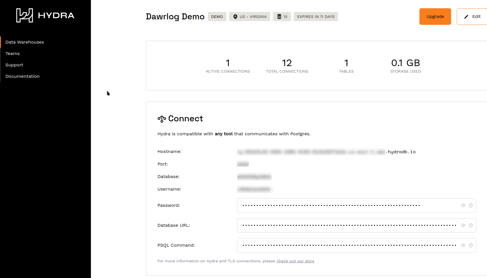
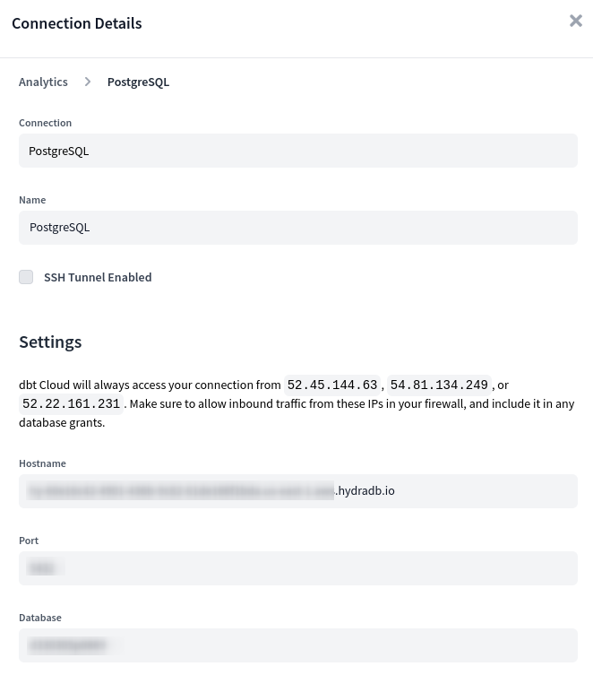
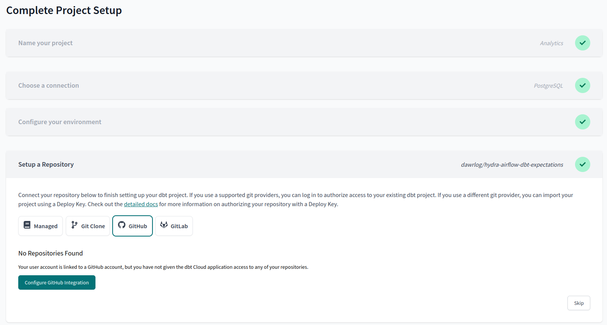
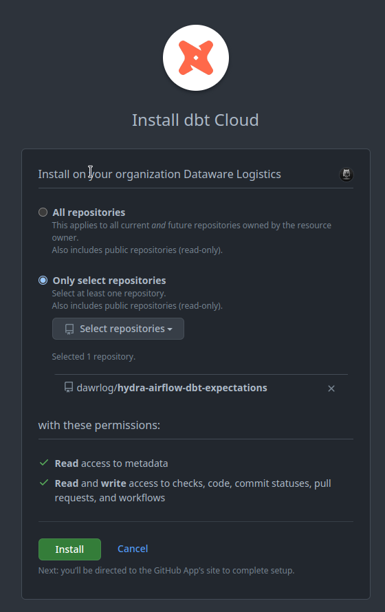
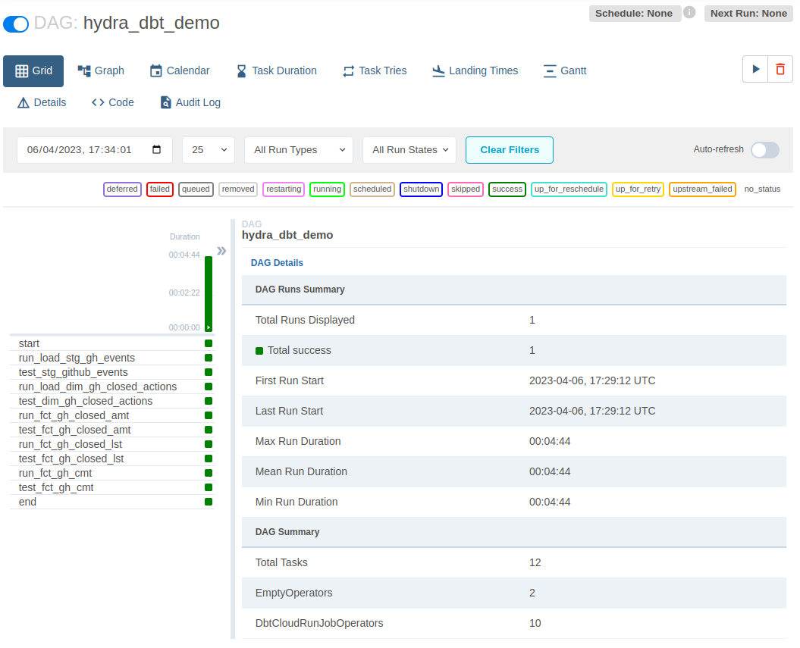
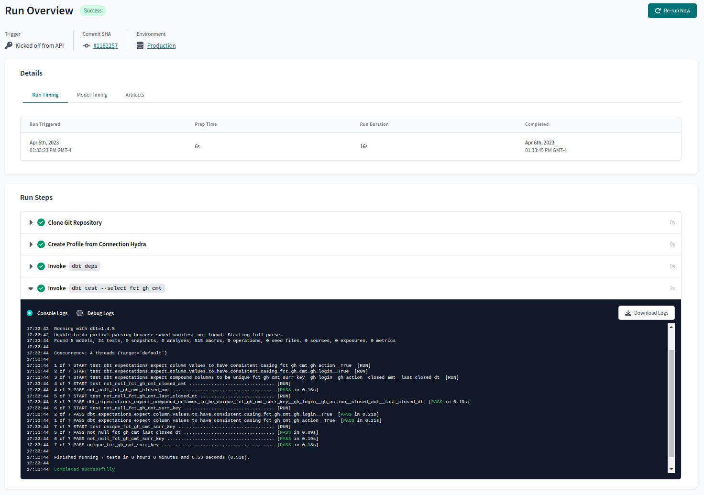

# Hydra Demo using Airflow and DBT Cloud with  Great Expectations
Local lab to run Airflow interacting with DBT Cloud to run on Hydra clusters.

The example below is to create a local Airflow cluster on Kubernetes which will interact with your DBT Cloud environment. The airflow component should be detached from this repository into your Github infrastructure one.

Choose postgres as connection and provide your Hydra connection credentials for the target datawarehouse. The image below is an example of these creadentials, and they are available at https://dashboard.hydras.io. 

 

Use the provided configuration while creating your DBT Cloud project:



Point only to the repository where your code resides, this narrows the attack surface of your environment.




This is done while configuring a new project on DBT Cloud, when a github integration is configured. You will then choose only the repository where your project resides. 



Below is a DBT Example of a successful integrated project.


# The following are required to proceed:
## Install Kind
```
curl -Lo ./kind https://kind.sigs.k8s.io/dl/v0.18.0/kind-linux-amd64
chmod +x ./kind
sudo mv ./kind /usr/local/bin/kind
```

## Install dependencies on Arch linux distribution:

`pacman -Sy kubectl helm docker`

## Configure Docker 
``` 
sudo usermod -aG docker $USER
systemctl start docker.service
systemctl start docker.socket
sudo systemctl daemon-reload
```

# Create Kind cluster

`kind create cluster --name airflow`

# Create image with local dags

```
docker build --pull \
--build-arg CONN_DBT_CLOUD="dbt-cloud://{YOUR DBT CLOUD ACCOUNT}:{YOUR DBT CLOUD SECRET KEY}@" \
--build-arg CONN_HYDRA="The url connection to your Hydra database" \
--tag oci_airflow_dbt_hydra:1.0 ./airflow
```

# Load the image into your local kind repository

`kind load docker-image oci_airflow_dbt_hydra:1.0 -n airflow`


# Add and update the apache-airflow repository
`helm repo add apache-airflow https://airflow.apache.org && helm repo update`


# Deploy your Airflow locally with custom image

```
helm upgrade --install hydra-dbt apache-airflow/airflow \
--set images.airflow.repository=oci_airflow_dbt_hydra \
--set images.airflow.tag=1.0 \
--namespace hydra --create-namespace
```

# Serve the Airflow console UI 
`kubectl port-forward svc/hydra-dbt-webserver 8080:8080 --namespace hydra`

# Log into the Airflow UI console with the default login credentials on localhost:8080 :
```
Default Webserver (Airflow UI) Login credentials:
    username: admin
    password: admin
```

# Trigger the dag from the console UI



You can find verbosed logs on your DBT Cloud console



# For metastore reference here is the default credentials:

```
Default Postgres connection credentials:
    username: postgres
    password: postgres
    port: 5432
```
